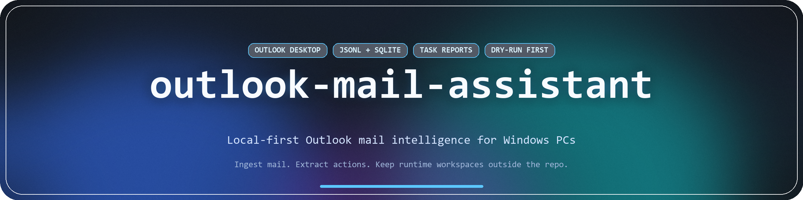

# outlook-mail-assistant

*A skill directory for agents that read and act on local Outlook mail in Windows.*

<p align="center">
  <a href="#what-this-repo-is">What This Repo Is</a> ·
  <a href="#skill-surface">Skill Surface</a> ·
  <a href="#repo-layout">Repo Layout</a> ·
  <a href="#validation">Validation</a> ·
  <a href="#safety-boundary">Safety Boundary</a>
</p>

<p align="center">
  
  
  
  
</p>

---

## What This Repo Is

This repository is a **skill directory for LLM agents**.

`SKILL.md` defines the skill. `scripts/` contains the local Python utilities the skill calls for validation and execution.

For Korean documentation, see [README.ko-KR.md](README.ko-KR.md).

## Skill Surface

Agents can use it to:

- ingesting mail from live Outlook desktop profiles
- importing `.msg` files and `.pst` archives
- normalizing mail into a consistent canonical schema
- extracting tasks, deadlines, meetings, decisions, and follow-ups
- exporting Markdown, CSV, XLSX, and DOCX review artifacts
- previewing or applying Outlook actions

Agent metadata for OpenAI lives in `agents/openai.yaml`.

## Repo Layout

```text
.
├─ SKILL.md
├─ README.md
├─ README.ko-KR.md
├─ agents/
│  └─ openai.yaml
├─ references/
│  ├─ canonical-schema.md
│  ├─ sqlite-schema.md
│  ├─ msg-gotchas.md
│  └─ pst-gotchas.md
├─ scripts/
│  ├─ export_outlook_json.py
│  ├─ import_pst.py
│  ├─ export_task_reports.py
│  ├─ execute_outlook_actions.py
│  ├─ convert_md_to_docx.py
│  └─ outlook_mail_assistant/
├─ tests/
├─ pyproject.toml
└─ .github/workflows/ci.yml
```

## Validation

Install the repo in editable mode:

```powershell
python -m pip install -e .[dev]
```

Optional runtime backends:

- live Outlook desktop access: `python -m pip install pywin32`
- `.msg` parsing: `python -m pip install extract-msg`
- `.pst` parsing: choose a backend according to `references/pst-gotchas.md`

Run tests:

```powershell
python -m pytest -q tests
```

Regenerate the cover image:

```powershell
python generate_cover.py
```

Validate the bundled DOCX converter:

```powershell
python scripts/convert_md_to_docx.py README.md output.docx
```

## Safety Boundary

This repo should contain no private mail data.

- keep runtime workspaces outside this repository
- treat generated JSONL, SQLite, CSV, XLSX, DOCX, and audit outputs as sensitive mail artifacts
- prefer dry-run flows before mailbox or calendar mutation
- review dependency and licensing constraints in `references/` before enabling optional parsers

## Cover Asset

`cover.png` is generated by `generate_cover.py` and can be regenerated locally.
